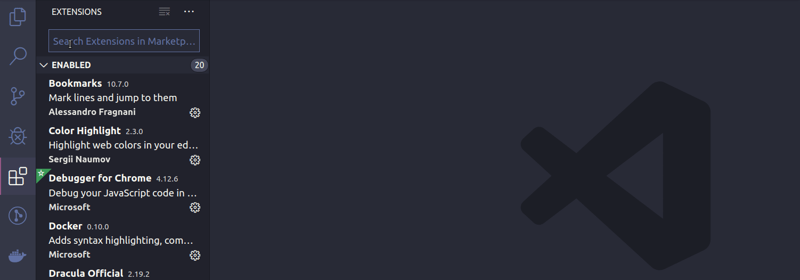
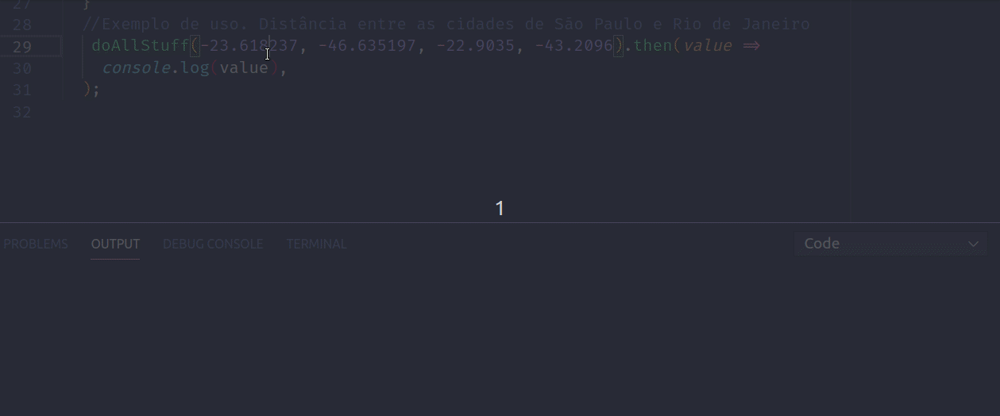
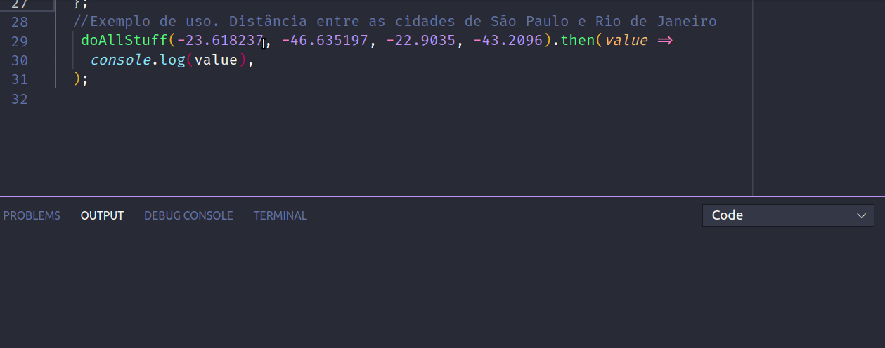

# Do All Stuff
> O projeto calcula a distância entre dois pontos.


Esta é a resposta da questão 06 do teste de processo seletivo Betta. O projeto calcula a distância entre dois pontos, o projeto possúi funções auxiliares para checkar os limites de distâncias de Latitude  que necessita de estar em 90° e  -90° e Longitude que precisa estar entre 180° e -180°.


## Dependências do projeto


Para utilizar o projeto em linha de comando é necessário ter o node instalado.

 - [clique aqui para instalar o nodejs ](https://nodejs.org/dist/v12.15.0/node-v12.15.0-linux-x64.tar.xz)
Para utilizar o projeto em linha de comando utilizando o **vscode** sugiro a instalação da extensão *code Runner*




## Significado das váriaveis

| variáveis   | tipo     | Significado        |
|-------------|----------|--------------------|
| l1          | number   | Latitude ponto 1   |
| l2          | number   | Latitude ponto 2   |
| b1          | number   | Longitude ponto 1  |
| b2          | number   | Longitude ponto 2  |


## Retorno da Função

Esta função retorna uma promise do tipo number contendo   o resultado do calculo da distância entre dois pontos.

## Exemplo de uso e funcionamento


1. Adicione os parametros de latitude e longitude.

> Esta função precisa receber quatro parametros para funcionar corretamente ela necessíta de latitude e longitude dos dois pointos que irá calcular.


```js
doAllStuff(l1,b1,l2,b2);
```


2. Rode o Code Runner.

```
 ctrl + alt + n

```

3. Exemplo de uso  do  projeto calculo da distância entre **São Paulo** e **Rio de Janeiro**.


```js

doAllStuff(-23.618237, -46.635197, -22.9035, -43.2096).then(value =>
  console.log(value),
);

```




## Exemplo de erro de Uso

- A função apresenta erro quando a latitude não está entre **90°** e **-90**.
- A função apresenta erro quando a longitude nao está entre **180°** e **-180**.




## Configuração para Desenvolvimento

 - Este projeto foi feito utilizando **CommonJs**.


## Meta

Talita Azevedo – talita.azevedo360@gmail.com
Linkedin:[talita-azevedo](https://www.linkedin.com/in/talita-azevedo/)
Github:[@tnazevedo](https://github.com/tnazevedo)


